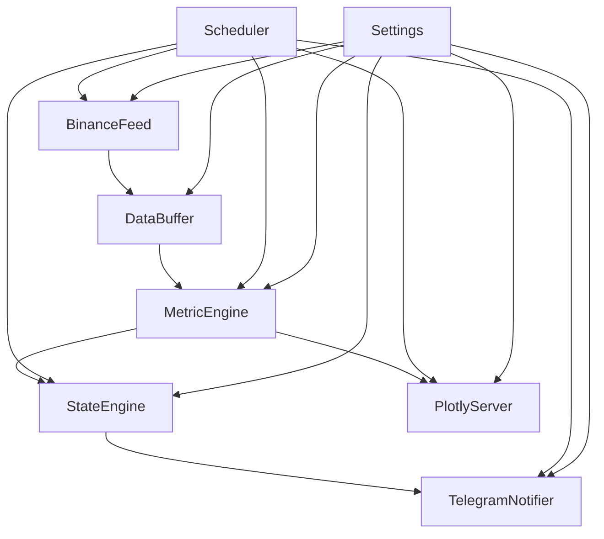

# Liquid Market Monitor

Production‑ready, contract‑annotated Python application that ingests Binance order book &
trade data, computes microstructure metrics in real‑time, classifies market regime, serves
a Dash UI, and pushes Telegram alerts.

## Architecture



## Scheduler Usage

```python
import asyncio
from scheduler.scheduler import Scheduler

async def main() -> None:
    sched = Scheduler()
    stop_task = sched.start()  # non-blocking
    # ... application runs ...
    sched.stop()
    await stop_task

asyncio.run(main())
```

## Metrics

`MetricEngine` derives several microstructure features from buffered Binance
data:

- **D** – aggregated order book depth
- **OFI** – order flow imbalance
- **S** – order book entropy
- **CI** – concentration index
- **T_L** – liquidity taking rate
- **φ** – normalised order flow
- **μ̇** – short term price drift
- **κ** – turbulence ratio

## Contracts

Every module and key class/function is annotated using **LynxContract** blocks.
Run-time enforcement can be toggled via the `LYNXCONTRACT` environment variable
(`VERIFY`, `ASSUME`, `OFF`).

## Quick Start

```bash
docker compose up --build
```

## Testing

Run the unit test suite:

```bash
pytest
```

## Running the UI

Launch the Plotly Dash interface to visualise metrics:

```bash
python -m plotly_server.server
```
